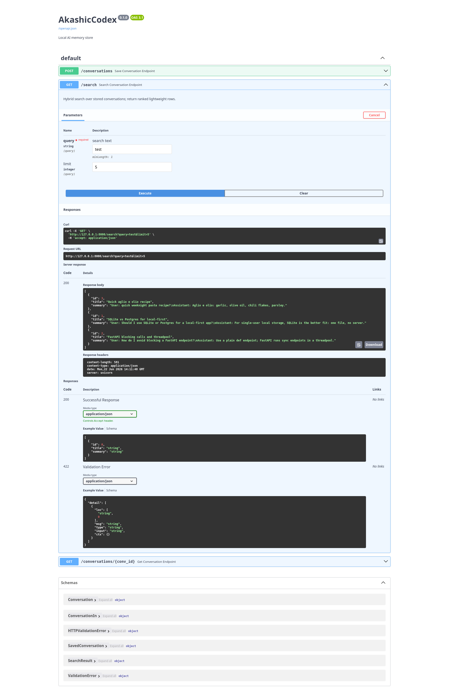

# AkashicCodex

[](https://github.com/Gardner-Programs/akashic-codex/actions/workflows/ci.yml)

A local, model-agnostic memory store for AI conversations.

The idea: your conversation history shouldn't live inside any one AI. AkashicCodex keeps it in a database you own, on your own machine, so you can switch freely between Claude, Gemini, a local Ollama model, or whatever comes next, and your context follows you. When one model runs out of usage, you switch to another and the memory is still there, because the memory *is* the database, not the model.

## How it works

Conversations are stored with a title, auto-generated topic tags, and a short summary alongside the full transcript. Search happens in two tiers: first it ranks the lightweight summaries (fast and cheap), then it loads the full transcript only for a match (expensive, done rarely). Search is hybrid: keyword search via SQLite FTS5 for precision, plus semantic vector search via `sqlite-vec` so it finds the right conversation even when you phrase things differently than you did before.

Any model talks to the same simple core (save, search, get) through whichever interface fits: a CLI, a REST API, and an MCP server. No model-specific logic lives in the store, which is what makes models swappable.

## Stack

SQLite (single local file you own) + `sqlite-vec` for semantic search + a fixed local embedding model so vectors stay comparable and vendor-independent. FastAPI for the REST layer. Python throughout. The database layer is isolated in one module so migrating to Postgres + pgvector later, if ever needed, is a contained change.

## Quick start

```bash
python -m venv .venv && source .venv/bin/activate
pip install -r requirements.txt
cp .env.example .env
```

### CLI

```bash
python -m akashic_codex.cli init
python -m akashic_codex.cli save chat.txt --title "My chat" --source claude
python -m akashic_codex.cli search "the database decision"
python -m akashic_codex.cli show 1
```

### REST API

```bash
python -m akashic_codex.cli serve_api --reload     # serves on http://127.0.0.1:8000
```

Open the interactive docs at `http://127.0.0.1:8000/docs`, or call the endpoints directly:

```bash
curl -X POST localhost:8000/conversations -H "Content-Type: application/json" \
  -d '{"full_log": "User: ...\nAssistant: ...", "title": "My chat", "source": "claude"}'

curl "localhost:8000/search?query=the%20database%20decision&limit=5"
curl localhost:8000/conversations/1
```



### MCP server

Exposes the read side of the store (`search_memory` and `get_conversation`) as
MCP tools, so any MCP-capable model can recall your stored conversations
directly. Saving stays on the CLI and REST API by design: over MCP a model can
recall memory, not mutate it.

The server speaks stdio and is normally launched by the MCP client, not by hand.
Register it once with your client and it starts on demand.

Claude Code:

```bash
claude mcp add akashic-codex -- "$(pwd)/.venv/bin/python" -m akashic_codex.cli serve_mcp
```

Claude Desktop (`claude_desktop_config.json`):

```json
{
  "mcpServers": {
    "akashic-codex": {
      "command": "/absolute/path/to/akashic-codex/.venv/bin/python",
      "args": ["-m", "akashic_codex.cli", "serve_mcp"]
    }
  }
}
```

Use absolute paths so the client can find the project's virtualenv.

## Status

Active development. Roadmap steps 1-8 are built and tested.

- [x] Core storage (SQLite schema, save / read)
- [x] Keyword search (FTS5)
- [x] Embeddings + semantic vector search (`sqlite-vec`)
- [x] Hybrid search (reciprocal rank fusion)
- [x] Ingest pipeline (`save_conversation`: summarize, tag, embed, store)
- [x] CLI (`init` / `save` / `search` / `show` / `serve_api` / `serve_mcp`)
- [x] REST API (FastAPI: save / search / show)
- [x] MCP server (expose `search_memory` / `get_conversation` as tools)
- [ ] Polish (web view or TUI for demos)

CI runs ruff and pytest on every change. See [`docs/DESIGN.md`](docs/DESIGN.md) for the architecture and full roadmap.

## Layout

```
schema.sql                 database schema
src/akashic_codex/
  db.py                    all SQLite-specific code (swap point for Postgres)
  embeddings.py            single fixed embedding model
  ingest.py                save pipeline: summarize, tag, embed, store
  search.py                two-tier hybrid retrieval
  cli.py                   command-line entry point (init/save/search/show/serve_api/serve_mcp)
  api.py                   FastAPI REST layer
  mcp_server.py            MCP server layer (read-only tools over stdio)
tests/                     pytest
docs/DESIGN.md             architecture and roadmap
```
